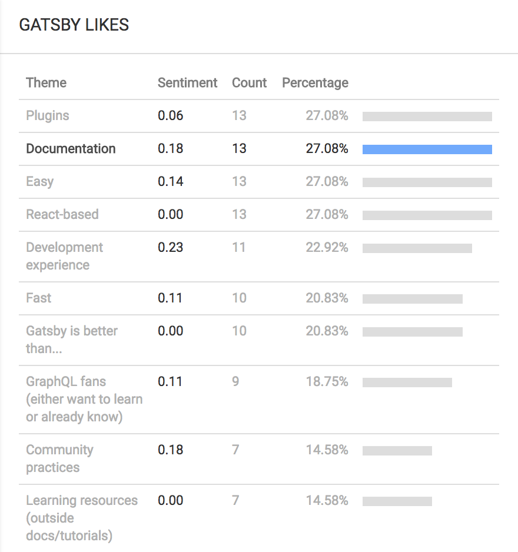

People really like Gatsby docs and Gatsby. In fact, we’ve talked about tracking the number of curse words and endearingly pejorative terms that people use when tweeting about Gatsby. Here’s a sampling:

## How much do people like the docs? :D

In my interviews with over 60 Gatsby users, I asked “What do you like about Gatsby?”. Documentation comes out as one of the clear winners, as you can see in this list of the top ten things interviewees like, courtesy of [Unbird.com](https://unbird.com/#/) analytics:

To dive a little deeper, here are some interview quotes about how much people like the docs and tutorials:

> “Very advanced docs & tutorials for this stage in a project.”
> “Tutorials are very beginner friendly and great for someone who wants to become a better developer.”
> “The tutorials are very easy to understand and go through great lengths to explain every line of code necessary.”

And some tweets:

So here's the bottom line: nearly everyone we’ve interviewed loves the Gatsby development experience and what the community has produced with the docs, guides, and tutorial. 

So why fix what isn’t broken?

## Enhancing the Tutorials

Many people have contributed to the docs and tutorials already and have done an excellent job. With that being said, there is still room to grow. 

Here is a brief overview of issues that have come up again and again as I've interviewed people and observed them going through the tutorials and docs (see [Issue #4175](/issues/4175/) on Github to follow this and contribute):

* Gatsby is beginner-friendly; however, _true_ beginners to programming need an intro to basic tools like the command line, code editors, and browser consoles.
* Upon first visit to Gatsbyjs.org, most visitors click “Get Started.” This is the perfect solution for them if they prefer to jump into coding without reading much. If they prefer step-by-step instructions, it takes some looking around before they see the tutorial tab across the top.
* Installing new starters for every part of tutorial feels like a distraction to some beginners.
"Part 1" is not a descriptive title for a tutorial if someone wants to preview or remember what was covered.
* Almost everyone is new to GraphQL and gets overwhelmed by Part 4.

## Documentation project beginnings

After outlining the issues above and attempting to solve them myself, I realized the pooled efforts of the community would be incredibly valuable in creating solutions to these issues. So, I created the Documentation Project in Github to plan and track documentation issues.

The [Documentation Project’s](https://github.com/gatsbyjs/gatsby/projects/3) goal is to make Gatsby documentation clear, organized, and useful. Issues in the project come from the community and/or interviews with community members. This project also provides a centralized way to plan, manage, and track our progress so that we maintain and enhance the docs and tutorials.

We know how easy the Gatsby development experience is for the majority of programmers, and some of that ease stems from clear docs and tutorials. Let’s keep up the good work.

## What you can do to help

If you'd like to contribute, look through this list of options and pick one that you'd like to help with! 
* Go to [Issue #4175](/issues/4175/) to help enhance the tutorials. 
* If you’d like to contribute to and/or follow other documentation projects, go here to find the [Documentation Project](https://github.com/gatsbyjs/gatsby/projects/3). 
* And, as always, if you have time to give us feedback on what you like about Gatsby and what can be improved in the docs/tutorials, schedule a time to chat with me here! [https://calendly.com/shannon-soper](https://calendly.com/shannon-soper)
