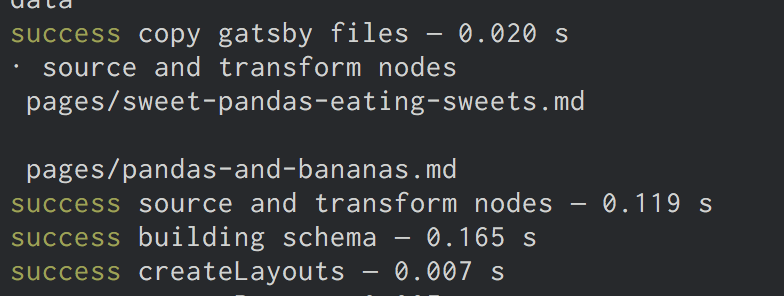
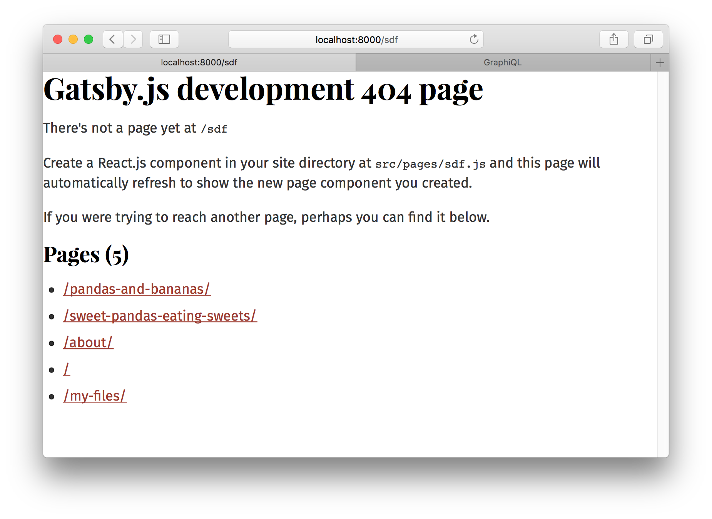
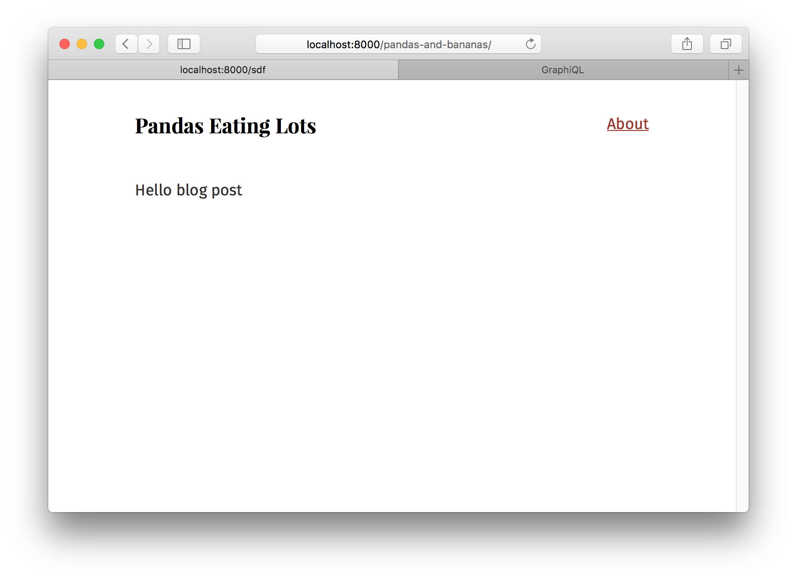

## What's in this tutorial?

In the previous tutorial, you created a nice index page that queries markdown
files and produces a list of blog post titles and excerpts. But you don't want to just see excerpts, you want actual pages for your
markdown files.

You could continue to create pages by placing React components in `src/pages`. However, you'll
now learn how to _programmatically_ create pages from _data_. Gatsby is _not_
limited to making pages from files like many static site generators. Gatsby lets
you use GraphQL to query your _data_ and _map_ the query results to _pages_—all at build
time. This is a really powerful idea. You'll be exploring its implications and
ways to use it for the remainder of this part of the tutorial.

Let's get started.

## Creating slugs for pages

Creating new pages has two steps:

1.  Generate the "path" or "slug" for the page.
2.  Create the page.

_**Note**: Often data sources will directly provide a slug or pathname for content — when working with one of those systems (e.g. a CMS), you don't need to create the slugs yourself like you do with markdown files._

To create your markdown pages, you'll learn to use two Gatsby APIs
[`onCreateNode`](/docs/node-apis/#onCreateNode) and
[`createPages`](/docs/node-apis/#createPages). These are two workhorse APIs
you'll see used in many sites and plugins.

We do our best to make Gatsby APIs simple to implement. To implement an API, you export a function
with the name of the API from `gatsby-node.js`.

So let's do that. In the root of your site, create a file named
`gatsby-node.js`. Then add to it the following. This function will be called by
Gatsby whenever a new node is created (or updated).

```javascript
exports.onCreateNode = ({ node }) => {
  console.log(node.internal.type)
}
```

Stop and restart the development server. As you do, you'll see quite a few newly
created nodes get logged to the terminal console.

Let's use this API to add the slugs for your markdown pages to `MarkdownRemark`
nodes.

Change your function so it now only logs `MarkdownRemark` nodes.

```javascript{2-4}
exports.onCreateNode = ({ node }) => {
  if (node.internal.type === `MarkdownRemark`) {
    console.log(node.internal.type)
  }
}
```

You want to use each markdown file name to create the page slug. So
`pandas-and-bananas.md"` will become `/pandas-and-bananas/`. But how do you get
the file name from the `MarkdownRemark` node? To get it, you need to _traverse_
the "node graph" to its _parent_ `File` node, as `File` nodes contain data you
need about files on disk. To do that, modify your function again:

```javascript{1,3-4}
exports.onCreateNode = ({ node, getNode }) => {
  if (node.internal.type === `MarkdownRemark`) {
    const fileNode = getNode(node.parent)
    console.log(`\n`, fileNode.relativePath)
  }
}
```

There in your terminal you should see the relative paths for your two markdown
files.



Now let's create slugs. As the logic for creating slugs from file names can get
tricky, the `gatsby-source-filesystem` plugin ships with a function for creating
slugs. Let's use that.

```javascript{1,5}
const { createFilePath } = require(`gatsby-source-filesystem`)

exports.onCreateNode = ({ node, getNode }) => {
  if (node.internal.type === `MarkdownRemark`) {
    console.log(createFilePath({ node, getNode, basePath: `pages` }))
  }
}
```

The function handles finding the parent `File` node along with creating the
slug. Run the development server again and you should see logged to the terminal
two slugs, one for each markdown file.

Now let's add your new slugs directly onto the `MarkdownRemark` nodes. This is
powerful, as any data you add to nodes is available to query later with GraphQL.
So it'll be easy to get the slug when it comes time to create the pages.

To do so, you'll use a function passed to our API implementation called
[`createNodeField`](/docs/bound-action-creators/#createNodeField). This function
allows you to create additional fields on nodes created by other plugins. Only
the original creator of a node can directly modify the node—all other plugins
(including your `gatsby-node.js`) must use this function to create additional
fields.

```javascript{3,4,6-11}
const { createFilePath } = require(`gatsby-source-filesystem`)

exports.onCreateNode = ({ node, getNode, actions }) => {
  const { createNodeField } = actions
  if (node.internal.type === `MarkdownRemark`) {
    const slug = createFilePath({ node, getNode, basePath: `pages` })
    createNodeField({
      node,
      name: `slug`,
      value: slug,
    })
  }
}
```

Restart the development server and open or refresh Graph_i_QL. Then run this
query to see your new slugs.

```graphql
{
  allMarkdownRemark {
    edges {
      node {
        fields {
          slug
        }
      }
    }
  }
}
```

Now that the slugs are created, you can create the pages.

## Creating pages

In the same `gatsby-node.js` file, add the following.

```javascript{15-34}
const { createFilePath } = require(`gatsby-source-filesystem`)

exports.onCreateNode = ({ node, getNode, actions }) => {
  const { createNodeField } = actions
  if (node.internal.type === `MarkdownRemark`) {
    const slug = createFilePath({ node, getNode, basePath: `pages` })
    createNodeField({
      node,
      name: `slug`,
      value: slug,
    })
  }
}

exports.createPages = ({ graphql, actions }) => {
  return new Promise((resolve, reject) => {
    graphql(`
      {
        allMarkdownRemark {
          edges {
            node {
              fields {
                slug
              }
            }
          }
        }
      }
    `).then(result => {
      console.log(JSON.stringify(result, null, 4))
      resolve()
    })
  })
}
```

You've added an implementation of the
[`createPages`](/docs/node-apis/#createPages) API which API Gatsby calls so plugins can add
pages.

As mentioned in the intro to this part of the tutorial, the steps to programmatically creating pages are:

1.  Query data with GraphQL
2.  Map the query results to pages

The above code is the first step for creating pages from your markdown as you're
using the supplied `graphql` function to query the markdown slugs you created.
Then you're logging out the result of the query which should look like:


You need one additional thing beyond a slug to create pages: a page template
component. Like everything in Gatsby, programmatic pages are powered by React
components. When creating a page, you need to specify which component to use.

Create a directory at `src/templates` and then add the following in a file named
`src/templates/blog-post.js`.

```jsx
import React from "react"
import Layout from "../components/layout"

export default () => {
  return (
    <Layout>
      <div>Hello blog post</div>
    </Layout>
  )
}
```

Then update `gatsby-node.js`

```javascript{1,17,32-42}
const path = require(`path`)
const { createFilePath } = require(`gatsby-source-filesystem`)

exports.onCreateNode = ({ node, getNode, actions }) => {
  const { createNodeField } = actions
  if (node.internal.type === `MarkdownRemark`) {
    const slug = createFilePath({ node, getNode, basePath: `pages` })
    createNodeField({
      node,
      name: `slug`,
      value: slug,
    })
  }
}

exports.createPages = ({ graphql, actions }) => {
  const { createPage } = actions
  return new Promise((resolve, reject) => {
    graphql(`
      {
        allMarkdownRemark {
          edges {
            node {
              fields {
                slug
              }
            }
          }
        }
      }
    `).then(result => {
      result.data.allMarkdownRemark.edges.forEach(({ node }) => {
        createPage({
          path: node.fields.slug,
          component: path.resolve(`./src/templates/blog-post.js`),
          context: {
            // Data passed to context is available
            // in page queries as GraphQL variables.
            slug: node.fields.slug,
          },
        })
      })
      resolve()
    })
  })
}
```

Restart the development server and your pages will be created! An easy way to
find new pages you create while developing is to go to a random path where
Gatsby will helpfully show you a list of pages on the site. If you go to
<http://localhost:8000/sdf> you'll see the new pages you created.



Visit one of them and you see:



Which is a bit boring and not what you want. Let's pull in data from your markdown post. Change
`src/templates/blog-post.js` to:

```jsx{4-5,8-11,14-25}
import React from "react"
import Layout from "../components/layout"

export default ({ data }) => {
  const post = data.markdownRemark
  return (
    <Layout>
      <div>
        <h1>{post.frontmatter.title}</h1>
        <div dangerouslySetInnerHTML={{ __html: post.html }} />
      </div>
    </Layout>
  )
}

export const query = graphql`
  query BlogPostQuery($slug: String!) {
    markdownRemark(fields: { slug: { eq: $slug } }) {
      html
      frontmatter {
        title
      }
    }
  }
`
```

And…


Sweet!

The last step is to link to your new pages from the index page.

Return to `src/pages/index.js` and let's query for your markdown slugs and create
links.

```jsx{3,23-29,45,64-66}
import React from "react"
import { css } from "react-emotion"
import { Link } from "gatsby"
import { rhythm } from "../utils/typography"
import Layout from "../components/layout"

export default ({ data }) => {
  return (
    <Layout>
      <div>
        <h1
          className={css`
            display: inline-block;
            border-bottom: 1px solid;
          `}
        >
          Amazing Pandas Eating Things
        </h1>
        <h4>{data.allMarkdownRemark.totalCount} Posts</h4>
        {data.allMarkdownRemark.edges.map(({ node }) => (
          <div key={node.id}>
            <Link
              to={node.fields.slug}
              className={css`
                text-decoration: none;
                color: inherit;
              `}
            >
              <h3
                className={css`
                  margin-bottom: ${rhythm(1 / 4)};
                `}
              >
                {node.frontmatter.title}{" "}
                <span
                  className={css`
                    color: #bbb;
                  `}
                >
                  — {node.frontmatter.date}
                </span>
              </h3>
              <p>{node.excerpt}</p>
            </Link>
          </div>
        ))}
      </div>
    </Layout>
  )
}

export const query = graphql`
  query IndexQuery {
    allMarkdownRemark(sort: { fields: [frontmatter___date], order: DESC }) {
      totalCount
      edges {
        node {
          id
          frontmatter {
            title
            date(formatString: "DD MMMM, YYYY")
          }
          fields {
            slug
          }
          excerpt
        }
      }
    }
  }
`
```

And there you go! A working, albeit small, blog!

## Challenge

Try playing more with the site. Try adding some more markdown files. Explore
querying other data from the `MarkdownRemark` nodes and adding them to the
frontpage or blog posts pages.

In this part of the tutorial, you've learned the foundations of building with
Gatsby's data layer. You've learned how to _source_ and _transform_ data using
plugins. How to use GraphQL to _map_ data to pages. Then how to build _page
template components_ where you query for data for each page.

## What's coming next?

Now that you've built a Gatsby site, where do you go next?

- Share your Gatsby site on Twitter and see what other people have created by searching for #gatsbytutorial! Make sure to mention @gatsbyjs in your Tweet, and include the hashtag #gatsbytutorial :)
- You could take a look at some [example sites](https://github.com/gatsbyjs/gatsby/tree/master/examples#gatsby-example-websites)
- Explore more [plugins](/docs/plugins/)
- See what [other people are building with Gatsby](https://github.com/gatsbyjs/gatsby/#showcase)
- Check out the documentation on [Gatsby's APIs](/docs/api-specification/), [nodes](/docs/node-interface/) or [GraphQL](/docs/graphql-reference/)
